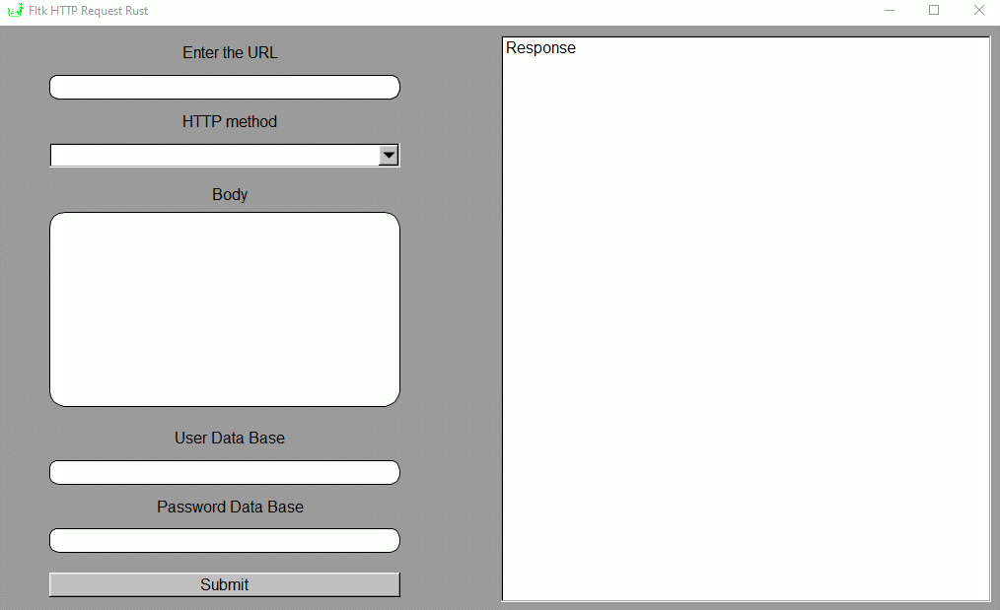

<div align="center">

  
  <h1 id="title">HTTP Tester</h1>
  <p>
    <strong>An HTTP tester built with Fltk in rust</strong>
  </p>

</div>

---

<div align="center">



</div>

Welcome to the HTTP Tester repository, an HTTP testing application built with the FLTK library for Rust. This project was created with the goal of providing a simple and easy to use tool for testing HTTP connections, either for development purposes or for performance evaluation.

The application features a graphical user interface built with FLTK.rs, a Rust binding library for FLTK, allowing for a smooth and enjoyable user experience. In addition, the application runs on Rust, a modern, secure, and high-performance programming language.

The main features of Http Tester include the ability to send custom HTTP requests, including GET, POST, PUT and DELETE method.

This repository is open to contributions of any kind, from user interface improvements to adding new features. Feel free to explore the source code, create new pull requests, or report bugs in the issues section.

<h4>Dependencies🎒</h4>

```toml
[package]
name = "gui-http-request-rust"
version = "0.1.0"
edition = "2021"

# See more keys and their definitions at https://doc.rust-lang.org/cargo/reference/manifest.html

[dependencies]
fltk = "1.3.33"
reqwest = "0.11.14"
tokio = { version = "1.26.0", features = ["full"] }
```

- The **fltk version 1.3.33** dependency, which is a GUI library for Rust based on the FLTK C++ library. This dependency is required for the creation of the graphical user interface.
- The **reqwest version 0.11.14** dependency, which is an easy-to-use and secure HTTP library for Rust. This library is required to make HTTP requests.
- The dependency **tokio version 1.26.0**, which is an asynchronous framework for Rust. The version includes all the features of the framework and is used to allow the program to make HTTP requests asynchronously. Using Tokyo allows the program to make multiple HTTP requests at the same time without blocking the user interface.

<h4>HTTP request📡 </h4>

Although HTTP requests have basic logic, the POST method does not allow the inclusion of overly complex headers or structures.

To deepen the operation of HTTP requests, it is important to review the code of each one of them and comment on their function in detail. In this sense, we will proceed to thoroughly examine the code of each request, in order to understand its structure and usefulness. It is important to highlight that, by analyzing the code, it will be possible to identify both strengths and weaknesses of each request, which will allow us to optimize its operation in possible modifications.

Likewise, it is essential to comment in detail on the function of each request, since this will allow us to understand its importance in the context of HTTP communication.

```rust
pub async fn http_request(
    method: i32,
    url: String,
    body: String,
    admin: String,
    password: String
) -> Result<String, Error> {
    let client: Client = Client::new();
    match method {
        0 => {
            let res: Response = client.get(&url).send().await?;
            return Ok(res.text().await?)
        },
        1 => {
            let res: Response = client.post(&url)
            .body(Body::from(body))
            .send()
            .await?;
            return Ok(res.text().await?)
        },
        2 => {
            let res = client
            .put(url)
            .header("Content-Type", "application/json")
            .body(body)
            .send()
            .await?;
            return Ok(res.text().await?)
        },
        3 => {
            let res = client.delete(&url)
            .basic_auth(&admin, Some(&password))
            .send()
            .await?;
            return Ok(res.text().await?)
        },
        _ => unreachable!(),
    }
}
```

The http_request function is an asynchronous function that takes five arguments: **method** which is an integer indicating the HTTP method to use in the request, **url** which is a string containing the URL of the request , **body** which is a string containing the data to be sent in the request body (if applicable), **admin** which is a string containing the name of the admin user (if applicable), and **password** which is a string containing the password of the admin user (if applicable).

The function uses the HTTP client from Rust's reqwest library to make HTTP requests and returns a result that can be a string containing the HTTP response body or an error if the request fails.

The function uses a match statement to perform a different action depending on the value of method. If method is 0, an HTTP GET request is made, if it is 1, an HTTP POST request is made, if it is 2, an HTTP PUT request is made, and if it is 3, an HTTP DELETE request is made. If method is not one of these values, a runtime error occurs using "unreachable!".

In each of the match cases, the HTTP client from the reqwest library is used to make the corresponding HTTP request, and the HTTP response body is returned as a string. Depending on the case, additional headers can also be included in the HTTP request, such as in the case of the HTTP PUT request where the "application/json" content-type is specified by using a header. In the case of the HTTP DELETE request, basic authentication is used to authenticate the administrator user using their username and password.

<h4>Download the .exe💿</h4>

To download the executable, simply click the [link](https://drive.google.com/drive/folders/1b1pJpGmoZ_ZKzJKHdnILf99v-Owz0228?usp=sharing) and the file will download directly to your computer if you're using Windows. If you use another operating system, instead of downloading the file, you can run the program directly from the files stored in this repository, following this steps:

```bash
git clone https://github.com/mateolafalce/gui-http-request-rust.git
```

```bash
cd gui-http-request-rust
```
```bash
cargo run --release
```

<h4>Apache 2.0 license📜</h4>

This repository is licensed under the Apache 2.0 license, which means it is open source software that can be freely used, modified, and distributed for both commercial and non-commercial purposes. The Apache License 2.0 establishes certain conditions for the use of the software, such as compliance with the copyright notices and the inclusion of a copy of the license in any distribution of the software. In addition, the license includes a limited liability clause that protects the licensee from any legal liability related to the use of the software.
